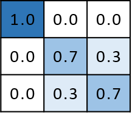
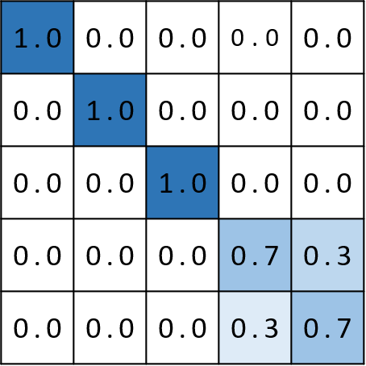

```{r setup, include=FALSE}
knitr::opts_chunk$set(echo = FALSE)
knitr::opts_chunk$set(fig.width=12, fig.height=7)
```

```{r,message=FALSE,warning=FALSE}
library(splatter)
library(Seurat)
library(speckle)
library(DCATS)
library(ggplot2)
library(tidyverse)
library(MCMCpack)
library(pROC)
library(patchwork)
library(ggpubr)
```

```{r}
source("functionsV2.r")
options(future.globals.maxSize = 20000 * 1024^2) # 20G memory
```

```{r}
theme_set(theme_classic()+
    theme(panel.border = element_blank(),
          legend.key = element_blank(),
          axis.ticks = element_blank(),
          panel.grid = element_blank(),
          panel.grid.minor = element_blank(), 
          panel.grid.major = element_blank(),
          panel.background = element_blank(),
          legend.background = element_blank(),
          plot.background = element_rect(fill = "transparent",colour = NA))+
      theme(axis.text=element_text(size=12),
        axis.title=element_text(size=14)))
```

```{r}
theme_set(theme_classic()+
            theme(panel.border = element_blank(),
          legend.key = element_blank(),
          axis.ticks = element_blank(),
          panel.grid = element_blank(),
          panel.grid.minor = element_blank(), 
          panel.grid.major = element_blank(),
          panel.background = element_blank(),
          legend.background = element_blank(),
          plot.background = element_rect(fill = "transparent",colour = NA)) + 
            theme(axis.text=element_text(size=12), axis.title=element_text(size=13))+
            theme(legend.title = element_text(size=13), #change legend title font size
                  legend.text = element_text(size=10)))
```

## Figure A

confusion matrix



#
```{r}
load("D:/Data/DCATS/simulation/toy_simulation.RData")
evaluationDF = data.frame()
len = length(simulationDF_list)
#for (j in 1:8){
for (j in 1:len){
  simulationDF = simulationDF_list[[j]] %>% na.omit()
  method = colnames(simulationDF)[3:dim(simulationDF)[2]]
  numb_mthd = length(method)
  sensitivity = rep(NA, numb_mthd)
  specificity = rep(NA, numb_mthd)
  mcc = rep(NA, numb_mthd)
  auc = rep(NA, numb_mthd)
  prauc = rep(NA, numb_mthd)
  F1 = rep(NA, numb_mthd)
  
  truth = simulationDF$truth
  for (i in 3:dim(simulationDF)[2]){
    pred = simulationDF[, i]
    pred_res = ifelse(pred < 0.05, "P", "N")
    TP <- sum(pred_res=="P"&truth=="P")
    TN <- sum(pred_res=="N"&truth=="N")
    FP <- sum(pred_res=="P"&truth=="N")
    FN <- sum(pred_res=="N"&truth=="P")
    truthN = TN + FP
    truthP = FN + TP
    predP = TP + FP
    predN = FN + TN
    sensitivity[i-2] = TP/truthP
    specificity[i-2] = TN/truthN
    mcc[i-2] = (TP*TN-FP*FN)/sqrt(predP*truthP*truthN*predN)
    auc[i-2] = getROC(truth, pred)$auc
    prauc[i-2] = getPRC(truth, pred)$prauc
    F1 = 2*TP/(2*TP+FP+FN)
    
    res = data.frame(trial = as.character(j), method = method, sensitivity = sensitivity, specificity = specificity, mcc = mcc, auc = auc, prauc = prauc, F1 = F1)
    }
    evaluationDF = rbind(evaluationDF, res)
}
```

## Fig A-2

```{r}
p1A1 = evaluationDF %>% 
  tidyr::separate(method, c("method", "condition"), sep = "_") %>% 
  dplyr::select(-sensitivity, -specificity) %>% 
  filter(condition != "test") %>% 
  filter(method %in% c("estPhi", "fisher")) %>% 
  mutate(method = ifelse(method == "fisher", "Fisher", method),
         method = ifelse(method == "estPhi", "DCATS", method)) %>% 
  ggplot(aes(x = condition, y = auc, color = method)) + geom_boxplot() +
  scale_color_manual(values=c("#F8766D", "#00B0F6")) +
  theme(axis.title.x = element_blank()) + 
  ylab("AUC") +
  scale_x_discrete(labels=c("null" = "no Bias Correction", "withBC" = "with Bias Correction")) 
p1A1
ggsave("./plot/Fig1_A2.png", bg = "transparent")
```

Plots -Supplementary1

```{r}
evaluationDF %>% 
  tidyr::separate(method, c("method", "condition"), sep = "_") %>% 
  dplyr::select(-sensitivity, -specificity) %>% 
  filter(condition != "test") %>% 
  mutate(method = ifelse(method == "fisher", "Fisher", method),
         method = factor(method, levels = c("wtoPhi", "adjPhi", "avrgPhi", "estPhi", "Fisher"))) %>% 
  ggplot(aes(x = condition, y = auc, color = method)) + geom_boxplot() +
  theme(axis.title.x = element_blank()) + 
  ylab("AUC") +
  scale_x_discrete(labels=c("null" = "no Bias Correction", "withBC" = "with Bias Correction"))
ggsave("./plot/supFig1A1.png", bg = "transparent")
```

Plots -Supplementary2

```{r}
evaluationDF %>% 
  tidyr::separate(method, c("method", "condition"), sep = "_") %>% 
  filter(condition != "test") %>% 
  dplyr::select(-auc, -prauc) %>% 
  pivot_longer(
    sensitivity:mcc,
    names_to = "statistics", 
    values_to = "value") %>% 
  mutate(condition = ifelse(condition == "null", "noBC", condition)) %>%
  ggplot(aes(x = condition, y = value, color = method)) + geom_boxplot() + facet_grid(.~statistics) +
  ylab("Value") +
    theme(axis.title.x = element_blank())
ggsave("./plot/supFig1A2.png", bg = "transparent")
```

```{r}
evaluationDF %>% 
  tidyr::separate(method, c("method", "condition"), sep = "_") %>% 
  filter(condition != "test") %>% 
  dplyr::select(-auc, -prauc) %>% 
  filter(method %in% c("estPhi", "fisher")) %>% 
  mutate(method = ifelse(method == "fisher", "Fisher", method),
         method = ifelse(method == "estPhi", "DCATS", method)) %>% 
  pivot_longer(
    sensitivity:mcc,
    names_to = "statistics", 
    values_to = "value") %>% 
  mutate(condition = ifelse(condition == "null", "noBC", condition)) %>%
  ggplot(aes(x = condition, y = value, color = method)) + geom_boxplot() +
  scale_color_manual(values=c("#F8766D", "#00B0F6")) +
  facet_grid(.~statistics) +
  ylab("Value") +
    theme(axis.title.x = element_blank())
ggsave("./plot/supFig1A.png", bg = "transparent")
```

```{r}
supA1 = phiDF %>% 
  ggplot(aes(x = eachPhi1, y = estPhi1)) +
  geom_point(aes(col = cluster), size = 0.5) + 
  theme(legend.position = "none") +
  xlab("eachPhi (no BC)") +
  ylab("estPhi (no BC)")
supA2 = phiDF %>% 
  ggplot(aes(x = eachPhi2, y = estPhi2)) +
  geom_point(aes(col = cluster), size = 0.5) +
  theme(legend.position = "none") +
  xlab("eachPhi (with BC)") +
  ylab("estPhi (with BC)")
supA3 = phiDF %>% 
  ggplot(aes(x = eachPhi1, y = eachPhi2)) +
  geom_point(aes(col = cluster), size = 0.5) +
  theme(legend.position = "none") +
  xlab("eachPhi (no BC)") +
  ylab("eachPhi (with BC)")
supA4 = phiDF %>% 
  ggplot(aes(x = estPhi1, y = estPhi2)) +
  geom_point(aes(col = cluster), size = 0.5) +
  theme(legend.position = "bottom") +
  xlab("estPhi (no BC)") +
  ylab("estPhi (with BC)")
(supA1 + supA2)/(supA3 + supA4)
ggsave("./plot/supFig1A3.png", bg = "transparent", width = 8, height = 5)
```

## Figure B

### Different number of replicates

```{r}
## cluster number = 8
filenames = list.files("D:/Data/DCATS/simulation", full.names = TRUE)
filenames = filenames[grep("K8_con100_splatter1500&2500withMilo.RData", filenames)]
filenames
```

```{r}
res_all = data.frame()

for (file in filenames) {
  load(file)
  method = colnames(clusterDF)[colnames(clusterDF) %>% str_detect("_pvals")] %>% str_remove("_pvals")
  method = c(method, "milo")
  numb_mthd = length(method)
  mcc = rep(NA, numb_mthd)
  auc = rep(NA, numb_mthd)
  prauc = rep(NA, numb_mthd)
  sensitivity = rep(NA, numb_mthd)
  specificity = rep(NA, numb_mthd)
  precision = rep(NA, numb_mthd)
  F1 = rep(NA, numb_mthd)
  truth = clusterDF$truth
  clusterDF = clusterDF %>% 
    mutate(milo_main = ifelse(milo_less > milo_more, milo_less, milo_more),
         milo_pct = milo_main/(milo_less + neutral + milo_more),
         milo_diff = abs(milo_less - milo_more)) %>% 
    dplyr::select(-milo_less, -milo_more, - neutral, -milo_main)
  for (i in 3:(dim(clusterDF)[2]-1)){
    pred = clusterDF[,i]
    if (colnames(clusterDF)[i] == "milo_pct") {
      pred_res = ifelse(clusterDF$milo_diff > 0, "P", "N")
      auc[i-2] = getROC(clusterDF$truth, 1-pred)$auc
      prauc[i-2] = getPRC(clusterDF$truth, 1-pred)$prauc}
    else {
      pred_res = ifelse(pred < 0.1, "P", "N")
      auc[i-2] = getROC(clusterDF$truth, pred)$auc
      prauc[i-2] = getPRC(clusterDF$truth, pred)$prauc}
    TP <- sum(pred_res=="P"&truth=="P")
    TN <- sum(pred_res=="N"&truth=="N")
    FP <- sum(pred_res=="P"&truth=="N")
    FN <- sum(pred_res=="N"&truth=="P")
    truthN = TN + FP
    truthP = FN + TP
    predP = TP + FP
    predN = FN + TN
    sensitivity[i-2] = TP/truthP
    specificity[i-2] = TN/truthN
    precision[i-2] = TP/predP
    mcc[i-2] = (TP*TN-FP*FN)/sqrt(predP*truthP*truthN*predN)
    F1[i-2] = 2*TP/(2*TP+FP+FN)
}
  res = data.frame(method = method, mcc = mcc, auc = auc, prauc = prauc, sensitivity = sensitivity, specificity = specificity, precision = precision, F1 = F1) %>% 
    arrange(desc(prauc)) %>% 
    mutate(replicates = str_extract(file, "\\d&\\d"))
  res_all = rbind(res_all, res)
}

res_all %>% 
  filter(method %in% c("estPhi_null", "estPhi_emK", "fisher", "speckle", "diffcyt", "betabin_null", "wtoPhi_emK", "scDC", "milo")) %>% 
  arrange(replicates, desc(prauc)) %>% 
  dplyr::select(method, mcc, prauc, sensitivity, specificity, F1, replicates) %>% 
  mutate(mcc = round(mcc, 3),
         prauc = round(prauc, 3),
         sensitivity = round(sensitivity, 3),
         specificity = round(specificity, 3),
         F1 = round(F1, 3))
```

```{r, warning=FALSE}
main_p1 = res_all %>% 
  filter(method %in% c("speckle", "diffcyt", "fisher", "scDC", "estPhi_emK", "milo")) %>%
  mutate(method = ifelse(method == "fisher", "Fisher", method)) %>% 
  mutate(method = ifelse(method == "estPhi_emK", "DCTAS", method)) %>% 
  mutate(method = factor(method, level = c("DCTAS", "speckle", "milo", "diffcyt", "Fisher", "scDC"))) %>% 
  ggplot(aes(x = replicates, y = prauc, color = method, group = method)) + 
  geom_point(shape = 0) +
  geom_line()+
  xlab("# of Replicates") +
  #theme(legend.position = "none") + 
  ylab("AUC")
main_p1
```


```{r, warning=FALSE}
## the following plot contains all DCATS model
p1 = res_all %>% 
  filter(method %in% c("speckle", "diffcyt", "fisher", "scDC", "betabin_null", "estPhi_null", "wtoPhi_emK", "estPhi_emK")) %>%
  mutate(method = ifelse(method == "fisher", "Fisher", method)) %>% 
  mutate(method = factor(method, level = c("scDC", "wtoPhi_emK", "betabin_null", "speckle", "diffcyt", "Fisher", "estPhi_emK", "estPhi_null"))) %>% 
  ggplot(aes(x = replicates, y = auc, color = method, group = method)) + 
  geom_point(shape = 0) +
  geom_line()+
  xlab("# of Replicates") +
  theme(legend.position = "none") + 
  ylab("AUC")
p1
```

```{r}
p2 = res_all %>% 
  filter(method %in% c("speckle", "diffcyt", "fisher", "scDC", "betabin_null", "estPhi_null", "wtoPhi_emK", "estPhi_emK")) %>%
  mutate(method = ifelse(method == "fisher", "Fisher", method)) %>% 
  mutate(method = factor(method, level = c("scDC", "wtoPhi_emK", "betabin_null", "speckle", "diffcyt", "Fisher", "estPhi_emK", "estPhi_null"))) %>% 
  dplyr::select(method, sensitivity, specificity, mcc, replicates) %>% 
  pivot_longer(
    sensitivity:mcc,
    names_to = "statistics", 
    values_to = "value") %>% 
  ggplot(aes(x = replicates, y = value, color = method, group = method)) + 
  geom_point(shape = 0) +
  geom_line()+
  xlab("# of Replicates") +
  theme(legend.position = "none") + 
  facet_grid(.~statistics)
p2
```

Try to use heatmap

```{r}
sup1 = res_all %>% 
  filter(method %in% c("speckle", "diffcyt", "fisher", "scDC", "estPhi_emK")) %>%
  mutate(method = ifelse(method == "fisher", "Fisher", method)) %>% 
  mutate(method = ifelse(method == "estPhi_emK", "DCTAS", method)) %>% 
  mutate(method = factor(method, level = c("scDC", "Fisher", "speckle", "diffcyt", "DCTAS"))) %>% 
  dplyr::select(method, mcc, sensitivity, specificity, replicates) %>% 
  pivot_longer(mcc:specificity, names_to = "statistics", values_to = "value") %>% 
  ggplot(aes(replicates, method)) +
    geom_tile(aes(fill = value)) + 
    geom_text(aes(label = round(value, 3))) +
    scale_fill_gradient(low = "white", high = "red", limits = c(0,1)) +
  xlab("# of Replicates") +
  theme(legend.position = "none",
        axis.title.y = element_blank()) +
  facet_grid(.~statistics)
sup1
```

```{r}
pH1 = res_all %>% 
  filter(method %in% c("speckle", "diffcyt", "fisher", "scDC", "betabin_null", "estPhi_null", "wtoPhi_emK", "estPhi_emK")) %>%
  mutate(method = ifelse(method == "fisher", "Fisher", method)) %>% 
  mutate(method = factor(method, level = c("scDC", "wtoPhi_emK", "betabin_null", "speckle", "diffcyt", "Fisher", "estPhi_emK", "estPhi_null"))) %>% 
  arrange(desc(auc)) %>% 
  dplyr::select(method, auc, replicates) %>% 
  ggplot(aes(replicates, method)) +
    geom_tile(aes(fill = auc)) + 
    geom_text(aes(label = round(auc, 3))) +
    scale_fill_gradient(low = "white", high = "red", limits = c(0.7,1)) +
  xlab("# of Replicates") +
  theme(legend.position = "none")
pH1
```

```{r}
res_all %>% 
  filter(method %in% c("speckle", "diffcyt", "fisher", "scDC", "betabin_null", "estPhi_null", "wtoPhi_emK", "estPhi_emK")) %>%
  mutate(method = ifelse(method == "fisher", "Fisher", method)) %>% 
  mutate(method = factor(method, level = c("scDC", "wtoPhi_emK", "betabin_null", "speckle", "diffcyt", "Fisher", "estPhi_emK", "estPhi_null"))) %>% 
  mutate(mcc = round(mcc, 3),
         auc = round(auc, 3),
         sensitivity = round(sensitivity, 3),
         specificity = round(specificity, 3),
         F1 = round(F1, 3)) %>% 
  arrange(replicates, desc(auc)) %>% 
  knitr::kable()
```

### Different number of cell types

```{r}
## cluster number = 8
filenames = list.files("D:/Data/DCATS/simulation", full.names = TRUE)
filenames = filenames[grep("D:/Data/DCATS/simulation/replicates3&3", filenames)]
filenames = filenames[grep("withMilo", filenames)]
filenames
```

```{r}
res_all = data.frame()

for (file in filenames) {
  load(file)
  method = colnames(clusterDF)[colnames(clusterDF) %>% str_detect("_pvals")] %>% str_remove("_pvals")
  method = c(method, "milo")
  numb_mthd = length(method)
  mcc = rep(NA, numb_mthd)
  auc = rep(NA, numb_mthd)
  prauc = rep(NA, numb_mthd)
  sensitivity = rep(NA, numb_mthd)
  specificity = rep(NA, numb_mthd)
  precision = rep(NA, numb_mthd)
  F1 = rep(NA, numb_mthd)
  truth = clusterDF$truth
  clusterDF = clusterDF %>% 
    mutate(milo_main = ifelse(milo_less > milo_more, milo_less, milo_more),
         milo_pct = milo_main/(milo_less + neutral + milo_more),
         milo_diff = abs(milo_less - milo_more)) %>% 
    dplyr::select(-milo_less, -milo_more, - neutral, -milo_main)
  for (i in 3:(dim(clusterDF)[2]-1)){
    pred = clusterDF[,i]
    if (colnames(clusterDF)[i] == "milo_pct") {
      pred_res = ifelse(clusterDF$milo_diff > 0, "P", "N")
      auc[i-2] = getROC(clusterDF$truth, 1-pred)$auc
      prauc[i-2] = getPRC(clusterDF$truth, 1-pred)$prauc}
    else {
      pred_res = ifelse(pred < 0.1, "P", "N")
      auc[i-2] = getROC(clusterDF$truth, pred)$auc
      prauc[i-2] = getPRC(clusterDF$truth, pred)$prauc}
    TP <- sum(pred_res=="P"&truth=="P")
    TN <- sum(pred_res=="N"&truth=="N")
    FP <- sum(pred_res=="P"&truth=="N")
    FN <- sum(pred_res=="N"&truth=="P")
    truthN = TN + FP
    truthP = FN + TP
    predP = TP + FP
    predN = FN + TN
    sensitivity[i-2] = TP/truthP
    specificity[i-2] = TN/truthN
    precision[i-2] = TP/predP
    mcc[i-2] = (TP*TN-FP*FN)/sqrt(predP*truthP*truthN*predN)
    F1[i-2] = 2*TP/(2*TP+FP+FN)
}
  res = data.frame(method = method, mcc = mcc, auc = auc, prauc = prauc, sensitivity = sensitivity, specificity = specificity, precision = precision, F1 = F1) %>% 
    arrange(desc(prauc)) %>% 
    mutate(clustersN = str_extract(file, "K\\d\\d"))
  res_all = rbind(res_all, res)
}

res_all %>% 
  mutate(clustersN = ifelse(is.na(clustersN), "K8", clustersN),
         clustersN = str_remove(clustersN, "K"),
         clustersN = factor(clustersN, levels = c("8", "10", "12"))) %>% 
  filter(method %in% c("estPhi_null", "estPhi_emK", "fisher", "speckle", "diffcyt", "betabin_null", "wtoPhi_emK", "scDC", "milo")) %>% 
  arrange(clustersN, desc(prauc)) %>% 
  dplyr::select(method, mcc, prauc, sensitivity, specificity, F1, clustersN) %>% 
  mutate(mcc = round(mcc, 3),
         prauc = round(prauc, 3),
         sensitivity = round(sensitivity, 3),
         specificity = round(specificity, 3),
         F1 = round(F1, 3))
```

```{r, warning=FALSE}
main_p3 = res_all %>% 
  mutate(clustersN = ifelse(is.na(clustersN), "K8", clustersN),
         clustersN = str_remove(clustersN, "K"),
         clustersN = factor(clustersN, levels = c("8", "10", "12"))) %>% 
  filter(method %in% c("speckle", "diffcyt", "fisher", "scDC", "estPhi_emK")) %>%
  mutate(method = ifelse(method == "fisher", "Fisher", method)) %>% 
  mutate(method = ifelse(method == "estPhi_emK", "DCTAS", method)) %>% 
  mutate(method = factor(method, level = c("DCTAS", "speckle", "diffcyt", "Fisher", "scDC"))) %>% 
  ggplot(aes(x = clustersN, y = auc, color = method, group = method)) + 
  geom_point(shape = 0) +
  geom_line()+
  xlab("# of Cell Types") + 
  theme(axis.title.y = element_blank())
main_p3
```

```{r, warning=FALSE}
p3 = res_all %>% 
  mutate(clustersN = ifelse(is.na(clustersN), "K8", clustersN),
         clustersN = str_remove(clustersN, "K"),
         clustersN = factor(clustersN, levels = c("8", "10", "12"))) %>% 
  filter(method %in% c("speckle", "diffcyt", "fisher", "scDC", "betabin_null", "estPhi_null", "wtoPhi_emK", "estPhi_emK")) %>%
  mutate(method = ifelse(method == "fisher", "Fisher", method)) %>% 
  mutate(method = factor(method, level = c("scDC", "wtoPhi_emK", "betabin_null", "speckle", "diffcyt", "Fisher", "estPhi_emK", "estPhi_null"))) %>% 
  ggplot(aes(x = clustersN, y = auc, color = method, group = method)) + 
  geom_point(shape = 0) +
  geom_line()+
  xlab("# of Cell Types") + 
  theme(axis.title.y = element_blank())
p3
```

```{r}
p4 = res_all %>% 
  mutate(clustersN = ifelse(is.na(clustersN), "K8", clustersN),
         clustersN = str_remove(clustersN, "K"),
         clustersN = factor(clustersN, levels = c("8", "10", "12"))) %>% 
  filter(method %in% c("speckle", "diffcyt", "fisher", "scDC", "betabin_null", "estPhi_null", "wtoPhi_emK", "estPhi_emK")) %>%
  mutate(method = ifelse(method == "fisher", "Fisher", method)) %>% 
  mutate(method = factor(method, level = c("scDC", "wtoPhi_emK", "betabin_null", "speckle", "diffcyt", "Fisher", "estPhi_emK", "estPhi_null"))) %>% 
  dplyr::select(method, sensitivity, specificity, mcc, clustersN) %>% 
  pivot_longer(
    sensitivity:mcc,
    names_to = "statistics", 
    values_to = "value") %>% 
  ggplot(aes(x = clustersN, y = value, color = method, group = method)) + 
  geom_point(shape = 0) +
  geom_line()+
  xlab("# of Cell Types") +
  facet_grid(.~statistics) + 
  theme(axis.title.y = element_blank())
p4
```

```{r}
sup2 = res_all %>% 
  mutate(clustersN = ifelse(is.na(clustersN), "K8", clustersN),
         clustersN = str_remove(clustersN, "K"),
         clustersN = factor(clustersN, levels = c("8", "10", "12"))) %>% 
  filter(method %in% c("speckle", "diffcyt", "fisher", "scDC", "estPhi_emK")) %>%
  mutate(method = ifelse(method == "fisher", "Fisher", method)) %>% 
  mutate(method = ifelse(method == "estPhi_emK", "DCTAS", method)) %>% 
  mutate(method = factor(method, level = c("scDC", "Fisher", "speckle", "diffcyt", "DCTAS"))) %>% 
  dplyr::select(method, mcc, sensitivity, specificity, clustersN) %>% 
  pivot_longer(mcc:specificity, names_to = "statistics", values_to = "value") %>% 
  ggplot(aes(clustersN, method)) +
    geom_tile(aes(fill = value)) + 
    geom_text(aes(label = round(value, 3))) +
    scale_fill_gradient(low = "white", high = "red", limits = c(0,1)) +
  xlab("# of Cell Types") +
  theme(legend.position = "none",
        axis.text.y = element_blank(),
        axis.title.y = element_blank()) +
  facet_grid(.~statistics)
sup1 + sup2
ggsave("./plot/supFig1B.png", bg = "transparent", width = 10, height = 6)
```

```{r}
pH2 = res_all %>% 
  mutate(clustersN = ifelse(is.na(clustersN), "K8", clustersN),
         clustersN = str_remove(clustersN, "K"),
         clustersN = factor(clustersN, levels = c("8", "10", "12"))) %>% 
  filter(method %in% c("speckle", "diffcyt", "fisher", "scDC", "betabin_null", "estPhi_null", "wtoPhi_emK", "estPhi_emK")) %>%
  mutate(method = ifelse(method == "fisher", "Fisher", method)) %>% 
  mutate(method = factor(method, level = c("scDC", "wtoPhi_emK", "betabin_null", "speckle", "diffcyt", "Fisher", "estPhi_emK", "estPhi_null"))) %>% 
  ggplot(aes(clustersN, method)) +
    geom_tile(aes(fill = auc)) + 
    geom_text(aes(label = round(auc, 3))) +
    scale_fill_gradient(low = "white", high = "red", limits = c(0.6,1))+
  xlab("# of Cell Types") +
  theme(axis.text.y = element_blank(),
        axis.title.y = element_blank(),
        panel.grid.minor.y = element_blank())

#ggsave("C:/#Code/R/slides/image/RPG_discussion/test.png", bg = "transparent")
pH2
```

```{r}
res_all %>% 
  mutate(clustersN = ifelse(is.na(clustersN), "K8", clustersN),
         clustersN = str_remove(clustersN, "K"),
         clustersN = factor(clustersN, levels = c("8", "10", "12"))) %>% 
  filter(method %in% c("speckle", "diffcyt", "fisher", "scDC", "betabin_null", "estPhi_null", "wtoPhi_emK", "estPhi_emK")) %>%
  mutate(method = ifelse(method == "fisher", "Fisher", method)) %>% 
  mutate(method = factor(method, level = c("scDC", "wtoPhi_emK", "betabin_null", "speckle", "diffcyt", "Fisher", "estPhi_emK", "estPhi_null"))) %>% 
  mutate(mcc = round(mcc, 3),
         auc = round(auc, 3),
         sensitivity = round(sensitivity, 3),
         specificity = round(specificity, 3),
         F1 = round(F1, 3)) %>% 
  arrange(clustersN, desc(auc)) %>% 
  knitr::kable()
```

```{r}
main_p1 + main_p3
ggsave("./plot/Fig1_B.png", bg = "transparent", width = 10, height = 5)
p1+p3
ggsave("./plot/supFig1B1.png", bg = "transparent", width = 10, height = 5)
p2+p4
ggsave("./plot/supFig1B2.png", bg = "transparent", width = 10, height = 5)
pH1+pH2
ggsave("./plot/supFig1B3.png", bg = "transparent")
```

```{r, eval=FALSE}
pH1+pH2
ggsave("C:/#Code/R/slides/image/RPG_discussion/dcats_result1.png", bg = "transparent")
```

## Figure b2

```{r}
load("D:/Data/DCATS/simulation/replicates10&10_K8_con100_splatter1500&2500_covariate3.RData")
simulationDF = simulationDF %>% 
  mutate(factor = "condition") %>% 
  dplyr::select(cluster, truth, factor, everything())
simulationDF_age = simulationDF_age %>% 
  mutate(factor = "age") %>% 
  dplyr::select(cluster, truth, factor, everything())
simulationDF_gender = simulationDF_gender %>% 
  mutate(factor = "gender") %>% 
  dplyr::select(cluster, truth, factor, everything())
fileL = list(simulationDF, simulationDF_age, simulationDF_gender)
res_all = data.frame()
for (file in fileL) {
  simulationDF = file
  simulationDF = simulationDF %>% na.omit()
  method = colnames(simulationDF)[4:dim(simulationDF)[2]] %>% str_remove("_pvals")
  numb_mthd = length(method)
  mcc = rep(NA, numb_mthd)
  auc = rep(NA, numb_mthd)
  prauc = rep(NA, numb_mthd)
  F1 = rep(NA, numb_mthd)
  sensitivity = rep(NA, numb_mthd)
  specificity = rep(NA, numb_mthd)
  truth = simulationDF$truth
  for (i in 4:dim(simulationDF)[2]){
    auc[i-3] = getROC(simulationDF$truth, simulationDF[,i])$auc
    prauc[i-3] = getPRC(simulationDF$truth, simulationDF[,i])$prauc
    pred = simulationDF[, i]
    pred_res = ifelse(pred < 0.05, "P", "N")
    TP <- sum(pred_res=="P"&truth=="P")
    TN <- sum(pred_res=="N"&truth=="N")
    FP <- sum(pred_res=="P"&truth=="N")
    FN <- sum(pred_res=="N"&truth=="P")
    truthN = TN + FP
    truthP = FN + TP
    predP = TP + FP
    predN = FN + TN
    mcc[i-3] = (TP*TN-FP*FN)/sqrt(predP*truthP*truthN*predN)
    F1[i-3] = 2*TP/(2*TP+FP+FN)
    sensitivity[i-3] = TP/truthP
    specificity[i-3] = TN/truthN
}
  res = data.frame(method = method, mcc = mcc, prauc = prauc, auc = auc, sensitivity = sensitivity, specificity = specificity, F1 = F1) %>% 
    mutate(factor = unique(simulationDF$factor))
  res_all = rbind(res_all, res)
}
res_all
```

```{r}
p1B2 = res_all %>% 
  dplyr::select(method, auc, factor) %>% 
  pivot_wider(names_from = factor, values_from = auc) %>% 
  pivot_longer(condition:gender, names_to = "factor", values_to = "auc") %>% 
  filter(method %in% c("speckle", "diffcyt", "fisher", "scDC", "estPhi_emK")) %>%
  mutate(method = ifelse(method == "fisher", "Fisher", method),
         method = ifelse(method == "estPhi_emK", "DCATS", method)) %>% 
  mutate(method = factor(method, level = c("scDC", "speckle", "diffcyt", "Fisher", "DCATS")),
         factor = factor(factor, level = c("condition", "age", "gender"))) %>% 
  ggplot(aes(factor, method)) +
    geom_tile(aes(fill = auc)) + 
    geom_text(aes(label = ifelse(is.na(auc), "N.A.", as.character(round(auc, 3))))) +
    scale_fill_gradient(low = "white", high = "red", limits = c(0.5,0.9))+
  xlab("Covariates")
p1B2
ggsave("./plot/Fig1_C.png", bg = "transparent")
```

```{r}
p1B2_sup = res_all %>% 
  dplyr::select(method, auc, factor) %>% 
  pivot_wider(names_from = factor, values_from = auc) %>% 
  pivot_longer(condition:gender, names_to = "factor", values_to = "auc") %>% 
  filter(method %in% c("speckle", "diffcyt", "fisher", "scDC", "betabin_null", "estPhi_null", "wtoPhi_emK", "estPhi_emK")) %>%
  mutate(method = ifelse(method == "fisher", "Fisher", method)) %>% 
  mutate(method = factor(method, level = c("scDC", "speckle", "diffcyt", "Fisher", "estPhi_null", "estPhi_emK", "betabin_null", "wtoPhi_emK")),
         factor = factor(factor, level = c("condition", "age", "gender"))) %>% 
  ggplot(aes(factor, method)) +
    geom_tile(aes(fill = auc)) + 
    geom_text(aes(label = ifelse(is.na(auc), "N.A.", as.character(round(auc, 3))))) +
    scale_fill_gradient(low = "white", high = "red", limits = c(0.5,0.9))+
  xlab("Covariates")
p1B2_sup
ggsave("./plot/sim3_auc.png", bg = "transparent")
```

```{r}
p1B2_sup2 = res_all %>% 
  dplyr::select(method, mcc, factor) %>% 
  pivot_wider(names_from = factor, values_from = mcc) %>% 
  pivot_longer(condition:gender, names_to = "factor", values_to = "mcc") %>% 
  filter(method %in% c("speckle", "diffcyt", "fisher", "scDC", "betabin_null", "estPhi_null", "wtoPhi_emK", "estPhi_emK")) %>%
  mutate(method = ifelse(method == "fisher", "Fisher", method)) %>% 
  mutate(method = factor(method, level = c("scDC", "speckle", "diffcyt", "Fisher", "estPhi_null", "estPhi_emK", "betabin_null", "wtoPhi_emK")),
         factor = factor(factor, level = c("condition", "age", "gender"))) %>% 
  ggplot(aes(factor, method)) +
    geom_tile(aes(fill = mcc)) + 
    geom_text(aes(label = ifelse(is.na(mcc), "N.A.", as.character(round(mcc, 3))))) +
    scale_fill_gradient(low = "white", high = "red", limits = c(0,0.6))+
  xlab("Covariates")
p1B2_sup2
ggsave("./plot/sim3_mcc.png", bg = "transparent")
```

```{r}
p1B2_sup3 = res_all %>% 
  dplyr::select(method, F1, factor) %>% 
  pivot_wider(names_from = factor, values_from = F1) %>% 
  pivot_longer(condition:gender, names_to = "factor", values_to = "F1") %>% 
  filter(method %in% c("speckle", "diffcyt", "fisher", "scDC", "betabin_null", "estPhi_null", "wtoPhi_emK", "estPhi_emK")) %>%
  mutate(method = ifelse(method == "fisher", "Fisher", method)) %>% 
  mutate(method = factor(method, level = c("scDC", "speckle", "diffcyt", "Fisher", "estPhi_null", "estPhi_emK", "betabin_null", "wtoPhi_emK")),
         factor = factor(factor, level = c("condition", "age", "gender"))) %>% 
  ggplot(aes(factor, method)) +
    geom_tile(aes(fill = F1)) + 
    geom_text(aes(label = ifelse(is.na(F1), "N.A.", as.character(round(F1, 3))))) +
    scale_fill_gradient(low = "white", high = "red", limits = c(0.1,0.8))+
  xlab("Covariates")
p1B2_sup3
ggsave("./plot/sim3_f1.png", bg = "transparent")
```

```{r}
(main_p1 + main_p3) + theme(legend.position="bottom")

(p1A1 + p1A1)/((main_p1 + main_p3) + theme(legend.position="bottom")+p1B2)

ggsave("./plot/Fig1.png", bg = "transparent", width = 12, height = 8)
```


```{r}
res_all %>% 
  filter(method %in% c("speckle", "diffcyt", "fisher", "scDC", "betabin_null", "estPhi_null", "wtoPhi_emK", "estPhi_emK")) %>%
  arrange(factor, desc(F1))
```


## real-world data 1 - Experiment 7

The 'group' column started with 'B' is the indicators of replicates

```{r, echo=FALSE}
exp7_data <- read.csv("./data/real_world/Exp7_Adam_2017/celltypelabels_Haber.txt", sep="") %>% 
  rownames_to_column("cell") %>% 
  separate(cell, c("batch", "barcode", "condition", "clusterRes"), sep = "_") 
```

```{r}
cellnumDF = exp7_data %>% 
  group_by(batch, condition, clusterRes) %>% 
  summarise(n = n()) %>% 
  mutate(freq = round(n/sum(n), 3)) %>% 
  mutate(clusterRes = ifelse(clusterRes == "Endocrine", "Edo", clusterRes),
         clusterRes = ifelse(clusterRes == "Enterocyte", "E", clusterRes),
         clusterRes = ifelse(clusterRes == "Enterocyte.Progenitor", "EP", clusterRes),
         clusterRes = ifelse(clusterRes == "Goblet", "Gob", clusterRes),
         clusterRes = ifelse(clusterRes == "TA.Early", "TAE", clusterRes))
```

```{r}
order = cellnumDF %>% 
  filter(condition == "Control" | condition == "Hpoly.Day3") %>% 
  group_by(condition, clusterRes) %>% 
  summarise(mean = mean(freq)) %>% 
  pivot_wider(names_from = condition, values_from = mean) %>% 
  mutate(diff = abs(Control - Hpoly.Day3)) %>% 
  arrange(desc(diff))
pA1 = cellnumDF %>% 
  filter(condition == "Control" | condition == "Hpoly.Day3") %>% 
  mutate(clusterRes = factor(clusterRes, levels = c("Tuft", "Edo", "EP", "Stem", "Gob", "TAE", "E", "TA"))) %>% 
  ggplot(aes(x = clusterRes, y = freq, fill = condition, color = condition)) +
  geom_dotplot(binaxis='y', stackdir='center', 
               dotsize = 0.6,position = position_dodge(0.5)) + 
  ylab("proportion") +
  xlab("Haber2017") +
  theme(axis.text.x = element_text(angle = 45, hjust=1),
        axis.title.y = element_blank()) +
  theme(legend.position="top")
pA2 = cellnumDF %>% 
  filter(condition == "Control" | condition == "Hpoly.Day10") %>% 
  mutate(clusterRes = factor(clusterRes, levels = c("Tuft", "TAE", "Gob", "E", "EP", "Edo", "Stem", "TA"))) %>% 
  ggplot(aes(x = clusterRes, y = freq, fill = condition, color = condition)) +
  geom_dotplot(binaxis='y', stackdir='center', 
               dotsize = 0.6,position = position_dodge(0.5)) + 
  ylab("proportion") +
  xlab("Haber2017") +
  theme(axis.text.x = element_text(angle = 45, hjust=1)) +
  theme(legend.position="top") 
pA3 = cellnumDF %>% 
  filter(condition == "Control" | condition == "Salmonella") %>% 
  mutate(clusterRes = factor(clusterRes, levels = c("E", "Stem", "TA", "TAE", "EP", "Tuft", "Gob", "Edo"))) %>% 
  ggplot(aes(x = clusterRes, y = freq, fill = condition, color = condition)) +
  geom_dotplot(binaxis='y', stackdir='center', 
               dotsize = 0.6,position = position_dodge(0.5)) + 
  ylab("proportion") +
  xlab("Haber2017") +
  theme(axis.text.x = element_text(angle = 45, hjust=1),
        axis.title.y = element_blank()) +
  theme(legend.position="top")
pA1+pA2
ggsave("./plot/Fig1_C1.png", width = 8, height = 4)

```

```{r}
load("D:/Data/DCATS/real_world/Haber2017_res.RData")
all_resC3 %>% 
  dplyr::select(cluster, truth, contains('_Res')) %>% 
  dplyr::rename(origin = truth) %>% 
  pivot_longer(origin:speckle_Res, names_to = "method", values_to = "res") %>% 
  pivot_wider(names_from = cluster, values_from = res) %>% 
  mutate(method = str_remove(method, "_Res")) %>% 
  filter(method %in% c("origin", "estPhi_emSVM", "fisher", "scDC", "speckle")) %>% 
  mutate(method = ifelse(method == "estPhi_emSVM", "DCATS", method)) %>% 
  column_to_rownames("method") %>% 
  dplyr::select(Tuft, Endocrine, Enterocyte.Progenitor, Stem, Goblet, TA.Early, Enterocyte, TA) %>% 
  knitr::kable()

all_resC10 %>% 
  dplyr::select(cluster, truth, contains('_Res')) %>% 
  dplyr::rename(origin = truth) %>% 
  pivot_longer(origin:speckle_Res, names_to = "method", values_to = "res") %>% 
  pivot_wider(names_from = cluster, values_from = res) %>% 
  mutate(method = str_remove(method, "_Res")) %>% 
  filter(method %in% c("origin", "estPhi_emSVM", "fisher", "scDC", "speckle")) %>% 
  mutate(method = ifelse(method == "estPhi_emSVM", "DCATS", method)) %>% 
  column_to_rownames("method") %>% 
  dplyr::select(Tuft, TA.Early, Goblet, Enterocyte, Enterocyte.Progenitor, Endocrine, Stem, TA) %>% 
  knitr::kable()

all_resCS %>% 
  dplyr::select(cluster, truth, contains('_Res')) %>% 
  dplyr::rename(origin = truth) %>% 
  pivot_longer(origin:speckle_Res, names_to = "method", values_to = "res") %>% 
  pivot_wider(names_from = cluster, values_from = res) %>% 
  mutate(method = str_remove(method, "_Res")) %>% 
  filter(method %in% c("origin", "estPhi_emSVM", "fisher", "scDC", "speckle")) %>% 
  mutate(method = ifelse(method == "estPhi_emSVM", "DCATS", method)) %>% 
  column_to_rownames("method") %>% 
  dplyr::select(Enterocyte, Stem, TA, TA.Early, Enterocyte.Progenitor, Tuft, Goblet, Endocrine) %>% 
  knitr::kable()
```

```{r}
data("Haber2017")
Haber2017$svm_mat %>% knitr::kable()
```


## real-world data2 

```{r, echo=FALSE}
exp6_clusterInfo = read.delim("./data/real_world/Exp6_Kang/GSE96583_batch2.total.tsne.df.tsv") %>% 
  dplyr::rename(clusterRes = cell, condition = stim) %>% 
  rownames_to_column("cell") %>% 
  filter(!is.na(clusterRes))
head(exp6_clusterInfo)
exp6_clusterInfo %>% group_by(condition, clusterRes) %>% 
  summarise(n = n())
## check whether exist duplicate barcode -> no
exp6_clusterInfo %>% 
  group_by(cell) %>% 
  summarise(n = n()) %>% 
  filter(n > 1)
```

```{r}
ctrl_repInfo <- read.delim("./data/real_world/Exp6_Kang/ye1.ctrl.8.10.sm.best")
stim_repInfo <- read.delim("./data/real_world/Exp6_Kang/ye2.stim.8.10.sm.best")
head(ctrl_repInfo)
head(stim_repInfo)

exp6_repInfo = rbind(ctrl_repInfo, stim_repInfo) %>% 
  dplyr::rename(cell = BARCODE, batch = BEST) %>% 
  filter(str_detect(batch, 'SNG')) %>% 
  dplyr::select(cell, batch)
head(exp6_repInfo)
```

```{r}
exp6DF = exp6_clusterInfo %>% 
  merge(exp6_repInfo) %>% 
  group_by(condition, clusterRes, batch) %>% 
  summarise(n = n()) %>% 
  mutate(freq = round(n/sum(n), 3)) %>% 
  mutate(clusterRes = ifelse(clusterRes == "B cells", "B", clusterRes),
         clusterRes = ifelse(clusterRes == "CD14+ Monocytes", "cM", clusterRes),
         clusterRes = ifelse(clusterRes == "CD4 T cells", "Th", clusterRes),
         clusterRes = ifelse(clusterRes == "CD8 T cells", "Tc", clusterRes),
         clusterRes = ifelse(clusterRes == "FCGR3A+ Monocytes", "ncM", clusterRes),
         clusterRes = ifelse(clusterRes == "Megakaryocytes", "Mkc", clusterRes),
         clusterRes = ifelse(clusterRes == "NK cells", "NK", clusterRes),
         clusterRes = ifelse(clusterRes == "Dendritic cells", "DC", clusterRes))
pA4 = exp6DF %>% 
  mutate(condition = ifelse(condition == "stim", "Stimulated", "Control")) %>% 
  mutate(clusterRes = factor(clusterRes, levels = c("NK", "Tc", "cM", "ncM", "B", "Th", "DC", "Mkc"))) %>% 
  ggplot(aes(x = clusterRes, y = freq)) +
  geom_boxplot(aes(color = condition)) +
  theme(axis.text.x = element_text(angle = 45, hjust=1)) +
  theme(legend.position="top") +
  ylab("proportion") + 
  xlab("Kang2017")
```

```{r}
load("D:/Data/DCATS/real_world/Kang2017_res.RData")
all_res %>% 
  dplyr::select(cluster, truth, contains('_Res')) %>% 
  dplyr::rename(origin = truth) %>% 
  pivot_longer(origin:speckle_Res, names_to = "method", values_to = "res") %>% 
  pivot_wider(names_from = cluster, values_from = res) %>% 
  mutate(method = str_remove(method, "_Res")) %>% 
  filter(method %in% c("origin", "estPhi_emSVM", "fisher", "scDC", "speckle")) %>% 
  mutate(method = ifelse(method == "estPhi_emSVM", "DCATS", method)) %>% 
  column_to_rownames("method") %>% 
  knitr::kable()
```

## real-world data 3

```{r}
load("D:/Data/DCATS/Ren2021.RData")
data(Ren2021)
```

## test between different groups

control vs mild/moderate_progression

```{r}
designM_sub = Ren2021$designM %>% 
  filter(state == "control" | state == "mild/moderate_progression")
countM_sub = Ren2021$countM[rownames(designM_sub),]

simil_mat = create_simMat(dim(countM_sub)[2], confuse_rate=0.1)
betabin_null = dcats_GLM(countM_sub, designM_sub, base_model = 'FULL')
wtoPhi_emU = dcats_GLM(countM_sub, designM_sub, similarity_mat = simil_mat, n_samples = NULL, base_model = 'FULL')
phi = getPhi(countM_sub, designM_sub)
estPhi_null = dcats_GLM(countM_sub, designM_sub, fix_phi = phi, base_model = 'FULL')
estPhi_emU = dcats_GLM(countM_sub, designM_sub, similarity_mat = simil_mat, n_samples = NULL, fix_phi = phi, base_model = 'FULL')

stat.test1 = data.frame(group1 = "control", group2 = "mild/moderate (progression)", p = estPhi_emU$LRT_pvals[,4]) %>% 
  rownames_to_column("clusterRes")

wtoPhi_emU$LRT_pvals
estPhi_emU$LRT_pvals
```

control vs severe/critical_progression

```{r}
designM_sub = Ren2021$designM %>% 
  filter(state == "control" | state == "severe/critical_progression")
countM_sub = Ren2021$countM[rownames(designM_sub),]

simil_mat = create_simMat(dim(countM_sub)[2], confuse_rate=0.1)
betabin_null = dcats_GLM(countM_sub, designM_sub, base_model = 'FULL')
wtoPhi_emU = dcats_GLM(countM_sub, designM_sub, similarity_mat = simil_mat, n_samples = NULL, base_model = 'FULL')
phi = getPhi(countM_sub, designM_sub)
estPhi_null = dcats_GLM(countM_sub, designM_sub, fix_phi = phi, base_model = 'FULL')
estPhi_emU = dcats_GLM(countM_sub, designM_sub, similarity_mat = simil_mat, n_samples = NULL, fix_phi = phi, base_model = 'FULL')

stat.test2 = data.frame(group1 = "control", group2 = "severe/critical (progression)", p = estPhi_emU$LRT_pvals[,4]) %>% 
  rownames_to_column("clusterRes")
```

```{r, eval=FALSE}
count_mat_sub %>% as.data.frame() %>% 
  cbind(design_mat_sub) %>% 
  rownames_to_column("sample_id") %>% 
  pivot_longer(names_to = "cell_type", values_to = "n", B:Neu) %>% 
  group_by(sample_id) %>% 
  mutate(prop = n/sum(n)) %>% 
  ggplot(aes(x = cell_type, y = prop)) +
    geom_boxplot(aes(color = state))
```


mild/moderate_convalescence vs mild/moderate_progression

```{r}
designM_sub = Ren2021$designM %>% 
  filter(state == "mild/moderate_convalescence" | state == "mild/moderate_progression")
countM_sub = Ren2021$countM[rownames(designM_sub),]

simil_mat = create_simMat(dim(countM_sub)[2], confuse_rate=0.1)
betabin_null = dcats_GLM(countM_sub, designM_sub, base_model = 'FULL')
wtoPhi_emU = dcats_GLM(countM_sub, designM_sub, similarity_mat = simil_mat, n_samples = NULL, base_model = 'FULL')
phi = getPhi(countM_sub, designM_sub)
estPhi_null = dcats_GLM(countM_sub, designM_sub, fix_phi = phi, base_model = 'FULL')
estPhi_emU = dcats_GLM(countM_sub, designM_sub, similarity_mat = simil_mat, n_samples = NULL, fix_phi = phi, base_model = 'FULL')
betabin_null$LRT_pvals < 0.05
wtoPhi_emU$LRT_pvals < 0.05
estPhi_null$LRT_pvals < 0.05
estPhi_emU$LRT_pvals < 0.05

stat.test3 = data.frame(group1 = "mild/moderate (convalescence)", group2 = "mild/moderate (progression)", p = estPhi_emU$LRT_pvals[,4]) %>% 
  rownames_to_column("clusterRes")

stat.test3
```

severe/critical_convalescence vs severe/critical_progression

```{r}
designM_sub = Ren2021$designM %>% 
  filter(state == "severe/critical_convalescence" | state == "severe/critical_progression")
countM_sub = Ren2021$countM[rownames(designM_sub),]

simil_mat = create_simMat(dim(countM_sub)[2], confuse_rate=0.1)
betabin_null = dcats_GLM(countM_sub, designM_sub, base_model = 'FULL')
wtoPhi_emU = dcats_GLM(countM_sub, designM_sub, similarity_mat = simil_mat, n_samples = NULL, base_model = 'FULL')
phi = getPhi(countM_sub, designM_sub)
estPhi_null = dcats_GLM(countM_sub, designM_sub, fix_phi = phi, base_model = 'FULL')
estPhi_emU = dcats_GLM(countM_sub, designM_sub, similarity_mat = simil_mat, n_samples = NULL, fix_phi = phi, base_model = 'FULL')
betabin_null$LRT_pvals < 0.05
wtoPhi_emU$LRT_pvals < 0.05
estPhi_null$LRT_pvals < 0.05
estPhi_emU$LRT_pvals < 0.05

stat.test4 = data.frame(group1 = "severe/critical (convalescence)", group2 = "severe/critical (progression)", p = estPhi_emU$LRT_pvals[,4]) %>% 
  rownames_to_column("clusterRes")
```


```{r}
Ren2021_plotDF = Ren2021$countM %>% 
  as.data.frame() %>% 
  merge(Ren2021$designM, by = 0) %>% 
  pivot_longer(B:Neu, names_to = "clusterRes", values_to = "count") %>% 
  group_by(Row.names) %>% 
  mutate(state = str_replace(state, "_convalescence", " (convalescence)"),
         state = str_replace(state, "_progression", " (progression)")) %>% 
  mutate(proportion = count / sum(count)) %>% 
  mutate(clusterRes = ifelse(clusterRes=="B", "B cells", clusterRes),
         clusterRes = ifelse(clusterRes=="CD4", "CD4+T cells", clusterRes),
         clusterRes = ifelse(clusterRes=="CD8", "CD8+ T cells", clusterRes),
         clusterRes = ifelse(clusterRes=="NK", "NK cells", clusterRes),
         clusterRes = ifelse(clusterRes=="Mono", "Monocytes", clusterRes),
         clusterRes = ifelse(clusterRes=="DC", "Dendritic cells", clusterRes),
         clusterRes = ifelse(clusterRes=="Mega", "Megakaryocytes", clusterRes),
         clusterRes = ifelse(clusterRes=="Macro", "Macrophages", clusterRes),
         clusterRes = ifelse(clusterRes=="Neu", "Neutrophils", clusterRes))
```

```{r}
p1 = ggplot(data = Ren2021_plotDF[Ren2021_plotDF$clusterRes %in% c("CD8+ T cells", "Monocytes", "CD4+T cells", "B cells", "Megakaryocytes", "Plasma"),], aes(x = state, y = proportion)) +
    geom_boxplot(aes(color = state)) +
    theme(axis.title.x=element_blank(),
        axis.text.x=element_blank(),
        axis.ticks.x=element_blank()) + 
    facet_grid(.~factor(clusterRes, levels=c("CD8+ T cells", "Monocytes", "CD4+T cells", "B cells", "Megakaryocytes", "Plasma"))) +
    theme(legend.position="none")


p2 = ggplot(data = Ren2021_plotDF[Ren2021_plotDF$clusterRes %in% c("NK cells", "Macrophages", "Dendritic cells", "Neutrophils"),], aes(x = state, y = proportion)) +
    geom_boxplot(aes(color = state)) +
    theme(axis.text.x=element_blank(),
          axis.ticks.x=element_blank()) +
    facet_grid(.~factor(clusterRes, levels=c("NK cells", "Macrophages", "Dendritic cells", "Neutrophils"))) + 
    theme(legend.position="bottom") +
  guides(color = guide_legend(nrow = 2))
p1/p2
```

```{r}
stat.test = stat.test1 %>% rbind(stat.test2) %>% rbind(stat.test3) %>% rbind(stat.test4) %>% 
  mutate(p.signif = ifelse(p < 0.01, "***", "n.s."),
         p.signif = ifelse(0.01<p&p<0.05, "**", p.signif),
         p.signif = ifelse(0.05<p&p<0.1, "*", p.signif)) %>% 
  filter(p.signif != 'n.s.') %>% 
  mutate(clusterRes = ifelse(clusterRes=="B", "B cells", clusterRes),
         clusterRes = ifelse(clusterRes=="CD4", "CD4+T cells", clusterRes),
         clusterRes = ifelse(clusterRes=="CD8", "CD8+ T cells", clusterRes),
         clusterRes = ifelse(clusterRes=="NK", "NK cells", clusterRes),
         clusterRes = ifelse(clusterRes=="Mono", "Monocytes", clusterRes),
         clusterRes = ifelse(clusterRes=="DC", "Dendritic cells", clusterRes),
         clusterRes = ifelse(clusterRes=="Mega", "Megakaryocytes", clusterRes),
         clusterRes = ifelse(clusterRes=="Macro", "Macrophages", clusterRes),
         clusterRes = ifelse(clusterRes=="Neu", "Neutrophils", clusterRes)) %>% 
  mutate(color = ifelse(!((clusterRes == "CD8+ T cells"&group1 == "control"&group2 == "mild/moderate (progression)") | (clusterRes == "Monocytes"&group1 == "mild/moderate (convalescence)"&group2 == "mild/moderate (progression)")), "y1", "y2"))

```

```{r}
pB1 = ggplot(data = Ren2021_plotDF[Ren2021_plotDF$clusterRes %in% c("CD8+ T cells", "Monocytes", "CD4+T cells", "B cells", "Megakaryocytes", "Plasma"),], aes(x = state, y = proportion)) +
    geom_boxplot(aes(color = state)) +
    theme(axis.title.x=element_blank(),
        axis.text.x=element_blank(),
        axis.ticks.x=element_blank()) + 
    facet_grid(.~factor(clusterRes, levels=c("CD8+ T cells", "Monocytes", "CD4+T cells", "B cells", "Megakaryocytes", "Plasma"))) +
    theme(legend.position="bottom")

pB2 = ggplot(data = Ren2021_plotDF[Ren2021_plotDF$clusterRes %in% c("NK cells", "Macrophages", "Dendritic cells", "Neutrophils"),], aes(x = state, y = proportion)) +
    geom_boxplot(aes(color = state)) +
    theme(axis.text.x=element_blank(),
          axis.ticks.x=element_blank()) +
    facet_grid(.~factor(clusterRes, levels=c("NK cells", "Macrophages", "Dendritic cells", "Neutrophils"))) + 
    theme(legend.position="bottom") +
  guides(color = guide_legend(nrow = 2))

stat.testp1 = stat.test %>% 
  mutate(y.position = ifelse(group1 == "control" & group2 == "severe/critical_progression", 0.95, 0.9),
         y.position = ifelse(group1 == "mild/moderate_convalescence" & group2 == "mild/moderate_progression", 0.1, y.position),
         y.position = ifelse(group1 == "severe/critical_convalescence" & group2 == "severe/critical_progression", 0.15, y.position)) %>% 
  filter(clusterRes %in% c("CD8+ T cells", "Monocytes", "CD4+T cells", "B cells", "Megakaryocytes", "Plasma"))
stat.testp2 = stat.test %>% 
  mutate(y.position = ifelse(group1 == "control" & group2 == "severe/critical_progression", 0.4, 0.35),
         y.position = ifelse(group1 == "mild/moderate_convalescence" & group2 == "mild/moderate_progression", 0.45, y.position),
         y.position = ifelse(group1 == "severe/critical_convalescence" & group2 == "severe/critical_progression", 0.5, y.position)) %>% 
  filter(clusterRes %in% c("NK cells", "Macrophages", "Dendritic cells", "Neutrophils"))

library(ggprism)
#p1 + add_pvalue(stat.testp1, tip.length = 0.02)
#p2 + add_pvalue(stat.testp2, tip.length = 0.002)

(pA4+pA1+pA2+pA3)/(pB1 + add_pvalue(stat.testp1, tip.length = 0.015, step.increase = 0.03, colour = "color") + scale_color_manual(values=c("#F8766D", "#A3A500", "#00BF7D", "#00B0F6", "#E76BF3", "black", "red")))
ggsave("./plot/Fig2.png", width = 10, height = 12)
pB2
ggsave("./plot/supFig2C1.png", width = 10, height = 10)
```


